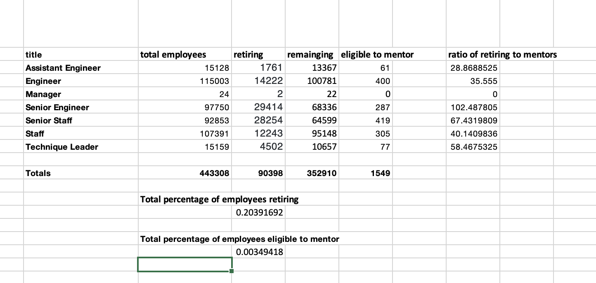

# Pewlett-Hackard-Analysis

## Overview of the analysis: 
In this analysis, we used SQL to sort through the various Employment data from Pewlett-Hackard to find which employees would soon be eligible for retirement in order to help the company plan for their future employment needs. We also looked at longer term employees who would be a good fit for a potential mentorship program. These soon-to-retire employees would were identified as possible mentors to help train and aclimate newer employees into the company. 

## Results: 

#### Deliverable 1 Results 
- Only 2 managers are in the retirement eligible group. This is not a position that will need recruitment. 
- The large majority of the retirement eligible group are either Engineers/Senior Engineers or Staff/Senior Staff. Almost 90,000 employees (84,133) encompass these four categories. This is 93% of the retirement group.  
- Engineers and Staff titles will need to be heavily recruited due to the large amount that are retirement eligible. 
- There will also need to be further analysis of the current staff and engineers to see how many current employees are potential Senior Engineers or Senior Staff. If there are not enough current employees for these positions, then outside recruitment will be necessary in the future. 

#### Deliverable 2 Results 
- There are 1549 employees who qualify as eligible to be mentors in the mentorship program.  
- Most retirement eligible employees are considered either Engineers/Senior Engineers or Staff/Senior Staff job titles. 
- There are no current managers who are considered eligible for the mentorship program. 

## Summary: 

This analysis shows that there are a large number of the current employees that will be eligible for retirement in the coming years.  90,398 current Hewlett-Packard's current employees, or 20% of the work force will need to be filled as the "silver tsunami" begins to make an impact on Pewlett-Hackard. Most of these employees (84,133) are Engineers/Senior Engineers or Staff/Senior Staff. These areas of the company will need to be heavily recruited in order to offset any major issues with continuity when most of the retirements begin to happen. The total numbers of employees eligible for retirement per job title can be viewed in the second table included above.

Based on this analysis, it appears that there are not enough qualified, retirement-ready employees in some departments to mentor the next generation of Pewlett Hackard employees. If we assume that all the retiring employees will need to be replaced and mentored in the coming years, we can use that total as an estimate for the number of mentees that will participate in the program. If we then calculate the ratios of possible mentees per possible mentors we find that there are large ratios of 50 or more mentees per mentor in the areas of Technique Leader (59 mentees/mentor), Senior Staff (67 mentees/mentor), and Senior Engineer (103 mentees/mentor). The last group is especially impacted with a ratio of more than 100 mentees per mentor. It may be that the criterion for mentors needs to be expanded to include more potential mentors so that these ratios can be reduced to more reasonable numbers. 
    

