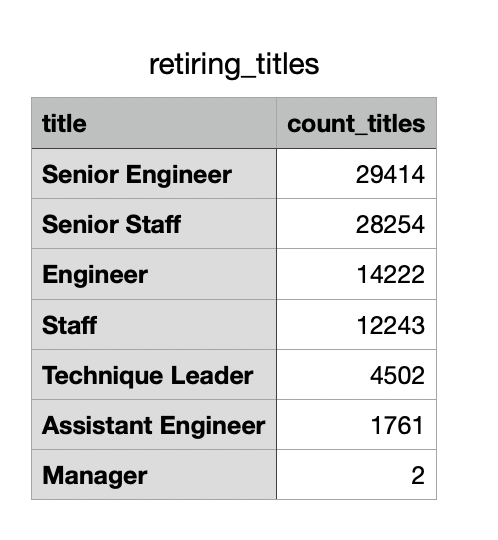
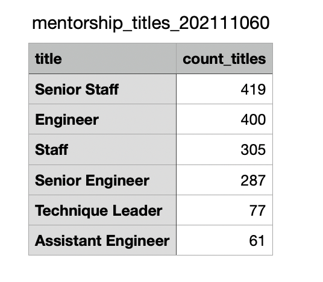

# Pewlett-Hackard-Analysis

## Overview of the analysis: 
In this analysis, we used SQL to sort through the various Employment data from Pewlett-Hackard to find which employees would soon be eligible for retirement in order to help the company plan for their future employment needs. We also looked at longer term employees who would be a good fit for a potential mentorship program. These soon-to-retire employees would were identified as possible mentors to help train and aclimate newer employees into the company. 

## Results: 
Provide a bulleted list with four major points from the two analysis deliverables. Use images as support where needed.

#### Deliverable 1 Results 
- Only 2 managers are in the retirement eligible group. This is not a position that will need recruitment. 
- The large majority of the retiremenet eligible group are either Engineers/Senior Engineers or Staff/Senior Staff. Almost 90,000 employees (84,133) encompass these four categories. This is 93% of the retirement group.  
- Engineers and Staff titles will need to be heavily recruited due to the large amount that are retirement eligible. 
- There will also need to be furhter analysis of the current staff and engineers to see how many current employees are potential Senior Enigneers or Senior Staff. If there is not enough current employees for these positions, then outside recruitment will be necessary in the future. 

#### Deliverable 2 Results 
- There are 1549 employees who qualify as eligible to be mentors in the mentorship program.  
- Most are have either Enigineers/Senior Engineers or Staff/Senior Staff job titles. 
- There are no current managers who are considered eligible for the mentorship program. 
- 

## Summary: 
Provide high-level responses to the following questions, then provide two additional queries or tables that may provide more insight into the upcoming "silver tsunami."
This analysis shows that there is a large number of the current employees that will be eligible for retirement in the coming years. A total of 90,398 current employees will need to be filled as the "silver tsunami" begins to make an impact on Pewlett-Hackard. The majority of these emplyees (84,133) are Engineers/Senior Engineers or Staff/Senior Staff. These areas of the company will need to be heavitly recruited in order to offset any major issues with continuity when the majority of the retirements begin to happen. 
  2. Are there enough qualified, retirement-ready employees in the departments to mentor the next generation of Pewlett Hackard employees? 
    - no. 

- additional queries could be performed on how many employees per mentor. PErformed outside of SQL and found ratios. 
- possible expand the mentor eligiblity citeria to include more employees as mentors. 
